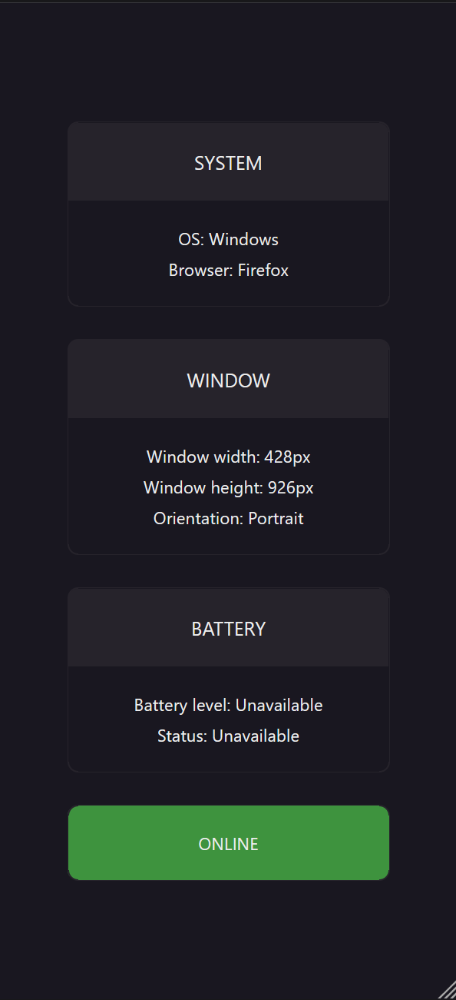

# Client Detection

This project uses the `window` object to extract information about the client.

The `window` object in JavaScript is the global object that represents the browser window or the environment in which your JavaScript code runs. It serves as the top-level object in the browser's Document Object Model (DOM) and provides access to various properties and methods that allow you to interact with the web page and the browser itself.

## Demo

[Click here to see the project](https://stefanoturcarelli.github.io/client-detection/)

